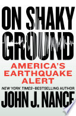
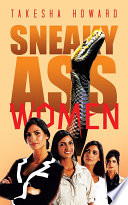
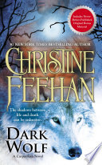
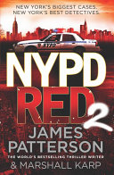
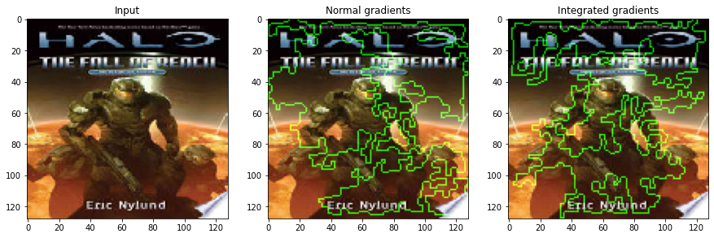
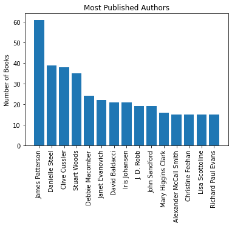

# How to Judge a Book by it's Cover
[Amazing Slideshow!](https://docs.google.com/presentation/d/1dBOCxwwQhlkWENBlZSQ7UV_Y1bZGVbXeL5g2gCk_074/edit?usp=sharing)

As everyone knows it's imposible for a human to judge a book by it's cover properly but when it comes to neural networks, they mirraculouly find a way. My hypothesis a neural network would be able to predict if a book cover was a NYT bestseller (2008-2018) with prediction accuracy over 0.5. 
The TensorFlow CNN I used had the following specifications:
 * Adam optimizer
 * Relu Activation Function
 * 3X3 Kernel Size
 * Categorical_crossentropy
 * Softmax activation function
>

This graph shows that my epoch should be low (4 to 6) because validation loss increases as validation accuaracy remains around the same.
Using overall accuacy as my metric 0.76 was the score of my model using 5 epochs. 

## Intresting Findings
>

	My model predicted these two images as non-best sellers with the highest certaintly. The second IS a best seller.

>

     My model predicts these book covers as best sellers with most the certainty when they are not.

>

    These two books had my model stumped with the lowest certainty each (~0.5 score). They are both best sellers.

>
>

    The residual plots the highest certainty best seller compaired with the a high certainty non-best seller. 

>
>

    I where to be magicly unblocked from querying google's API, 
    I would attempt to understand if my model learns to overfit baised on best seller's cover styles. 

I hope to deploy this interactive upload to my website [lynxrose.com](lynxrose.com) soon.

# Sources
[Kaggle NYT Best Sellers](https://www.kaggle.com/cmenca/new-york-times-hardcover-fiction-best-sellers) by [Carlo](https://www.kaggle.com/cmenca)

Data scraped from [Google Books API](https://developers.google.com/books/docs/overview)

Tools: Python, Matplotlib, Numpy, Pandas, and TensorFlow

GitHub Project by Lynx Rose
